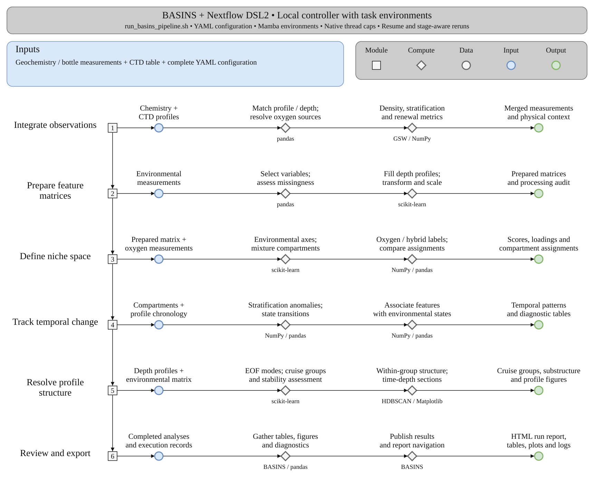

# BASINS: Biochemical Analysis Suite for Investigating Niche Spaces

Source repository: https://github.com/hallamlab/BASINS

BASINS is a Nextflow DSL2 workflow for integrating biogeochemical observations and characterizing environmental niche space. It builds cleaned environmental feature matrices, computes density and stratification summaries, derives PCA/EOF structure, assigns oxygen/GMM/hybrid compartments, and writes downstream compartment diagnostics.

Start with [installation](installation.md), then run the [bundled reviewer example](reviewer-test.md) or follow the [first-run walkthrough](quickstart.md) with your own data. Then use the input, interpretation, and configuration chapters to adapt BASINS to your own study.

```{container} primary-workflow
[](assets/workflow-brief.svg)
```

[Explore the detailed workflow](workflow.md) · [Overview SVG](assets/workflow-brief.svg) · [Overview PDF](assets/workflow-brief.pdf)

Arrows between numbered modules trace the conceptual flow of results. Optional branches depend on configuration; the detailed workflow explains task dependencies.

```{toctree}
:maxdepth: 2
:caption: Getting started

installation
quickstart
reviewer-test
inputs
```

```{toctree}
:maxdepth: 2
:caption: Understand and control the analysis

workflow
analyses
outputs
resources
CONFIGURATION
process-reference
troubleshooting
citations
documentation
```
