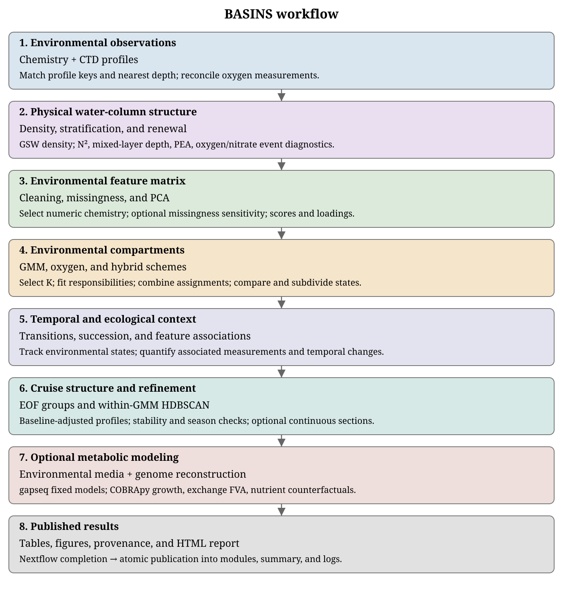

# BASINS

BASINS stands for **Biochemical Analysis Suite for Investigating Niche Spaces**.

Source repository: https://github.com/hallamlab/BASINS

BASINS is a Nextflow DSL2 workflow for integrating biogeochemical observations and characterizing environmental niche space. It builds cleaned environmental feature matrices, computes density and stratification summaries, derives PCA/EOF structure, assigns oxygen/GMM/hybrid compartments, and writes downstream compartment diagnostics. It can also train gapseq-compatible media from the final core+sparse biochemical matrix, reconstruct fixed genome-scale models with gapseq 2.1.0, and compare those models across supported media.

Start with [installation](installation.md) and the [first-run walkthrough](quickstart.md). Then use the input, interpretation, and configuration chapters to adapt BASINS to your own study.

```{container} primary-workflow
[](assets/workflow-main.svg)
```

```{toctree}
:maxdepth: 2
:caption: Getting started

installation
quickstart
reviewer-test
inputs
```

```{toctree}
:maxdepth: 2
:caption: Understand and control the analysis

workflow
analyses
genome-modeling
outputs
resources
CONFIGURATION
process-reference
troubleshooting
citations
documentation
```
