# BASINS workflow

```{container} primary-workflow
[](assets/workflow-main.svg)
```

[Download SVG](assets/workflow-main.svg) · [Download PDF](assets/workflow-main.pdf)

## Conceptual overview

[](assets/diagrams/conceptual.svg)

[Zoom diagram](assets/diagrams/conceptual.svg) · [Mermaid source](diagrams/conceptual.mmd)

## Software architecture

[](assets/diagrams/architecture.svg)

[Zoom diagram](assets/diagrams/architecture.svg) · [Mermaid source](diagrams/architecture.mmd)

## Detailed data flow

[](assets/diagrams/data-flow.svg)

[Zoom diagram](assets/diagrams/data-flow.svg) · [Mermaid source](diagrams/data-flow.mmd)

The full [process reference](process-reference.md) maps each stage to its script. The environmental path has ordered dependencies; optional genome reconstruction and media comparisons scatter by genome and converge before the summary. The diagram groups closely related stages for readability. [Interpretation](analyses.md), [genome modeling](genome-modeling.md), and [citations](citations.md) explain the methods and their limits.

## What BASINS estimates

BASINS describes environmental niche space from measured chemistry and physical
water-column observations. Its core products are environmental coordinates,
compartment memberships and profile/cruise diagnostics. An environmental
compartment is a model-derived description of observations, not a direct
measurement of a microbial population or proof of a biological niche boundary.

The optional genome branch asks a different question: how a fixed reconstructed
metabolic model responds to media derived from those environmental groups.
Keep the measured, statistically inferred and metabolically predicted products
separate when interpreting the output.

## Follow one observation through the workflow

### 1. Join chemistry and physical observations

The merge stage matches the configured profile identifiers and nearest depth.
The default identifiers include location, cruise and sampling date. Review the
match diagnostics before interpreting a missing value as a biological zero.
CTD oxygen and chemistry-derived oxygen are reconciled according to the
configured source rules; retain the source/provenance columns.

GSW-derived density feeds water-column diagnostics, including buoyancy-frequency
structure (N²), mixed-layer depth (MLD) and potential energy anomaly (PEA).
Renewal-event summaries additionally apply oxygen/nitrate, persistence and
missing-data criteria. These indicators depend on measurement units, depth
coverage and the selected thresholds. [Inputs](inputs.md) and
[output interpretation](outputs.md) define the required columns and diagnostics.

### 2. Construct an auditable environmental matrix

The cleaning stage renames and selects configured numeric measurements.
Missingness handling, profile-aware filling, transformations and scaling
produce the matrices used by later models. The optional missingness-sensitivity
stage evaluates candidate cutoffs and passes the selected cutoff to the PCA
stage; otherwise the configured cutoff is used.

Inspect the matrix coverage and preparation audit before the embedding or
compartment plot. Depth-profile interpolation is not a license to fill between
unrelated cruises. The distinction between frequently measured core features
and sparse measurements matters to both downstream interpretation and the
optional environmental-media recipe.

### 3. Fit environmental axes and compartment schemes

PCA produces coordinates for observations, component loadings and variance
summaries. GMM model selection chooses a compartment count before the final
mixture model is fitted. Responsibilities describe graded membership; the
most likely label discards some of that uncertainty.

Soft oxygen-threshold categories provide a complementary, explicitly
configured interpretation of oxygen conditions. Hybrid categories combine
oxygen and mixture membership. The pipeline then compares schemes and
subdivides oxygen categories by GMM. Compare membership strength, sample
support and profile structure rather than treating numerical component labels
as portable ecological names. A fresh fit can reorder components.

### 4. Examine temporal and cruise structure

Stratification anomalies, state transitions, succession graphs and feature
associations summarize how environmental states vary through the sampled
record. The resulting associations are observational: sampling gaps, uneven
depth coverage and unequal cruise representation can affect apparent change.

The EOF branch summarizes depth-profile variation relative to a baseline,
assigns cruise-scale groups and evaluates their stability and relationships
to seasons. These cruise groups are a different analysis unit from the
sample-level GMM compartments. Mode plots help show the depth/measurement
patterns associated with the cruise representation. Within-GMM HDBSCAN adds
local density-based structure; optional continuous time-depth sections provide
another view of the measurements and inferred structure.

### 5. Compare fixed genome models across media (optional)

The environmental-media stage combines group chemistry with a common basal
medium, recording ingredient selection, exclusions and recipe provenance.
The genome manifest launches reconstruction tasks for individual genome FASTAs.
gapseq reconstructs and gap-fills each genome model. Reconstruction can proceed
independently of the environmental chain; comparison waits for the required
media and a reconstructed model.

COBRApy evaluates media on copies of that fixed model. Growth predictions,
exchange flux variability and nutrient counterfactuals therefore compare
conditions within a specified reconstruction, rather than changing the model
for every condition. Aggregate results retain per-genome identity. A failed
growth prediction can reflect absent ingredients, reconstruction limitations
or solver/model assumptions; it is not evidence that the organism cannot live
in the sampled environment. See [genome modeling](genome-modeling.md).

### 6. Publish results coherently

The master summary waits for the selected environmental and genome outputs,
including optional continuous sections. The wrapper publishes the supported
results into module tables/plots, summary and logs. The current report filename
is `summary/report/BASIN_run_report.html`; the implementation retains this
singular filename even though the project is called BASINS.

Review the configuration, process logs and output inventory with the report.
A successful disabled-stage smoke test establishes that the controller can
start; it does not validate a biological dataset or its interpretation.
[Reviewer testing](reviewer-test.md) distinguishes these cases.

## Execution and source map

Most environmental tasks are explicitly ordered in `basin_pipeline.nf`.
Optional missingness sensitivity supplies a value to PCA, and genome
reconstruction/comparison scatters by genome before results are gathered.
The conceptual figure's separate evidence rows do not imply that all stages
run concurrently. Nextflow manages task dependencies and caches; the wrapper
manages configuration, environments, thread limits and result publication.

| Responsibility | Source |
|---|---|
| User entry point | `run_basins_pipeline.sh` |
| Configuration, controller environment, resume and publication | `run_basin_pipeline.sh` |
| Process dependencies, optional branches and genome scatter/gather | `basin_pipeline.nf` |
| Study configuration | `basin_pipeline_nextflow.yml` |
| Numerical and modeling environments | `processes/shared_envs/` |
| Environmental/process implementations | [Process reference](process-reference.md) |
| Continuous sections | `processes/continuous_sections/continuous_time_depth_sections.py` |

Community diversity, ASV indicators, ecological networks and cross-omic
validation can use BASINS assignments downstream. They are not silently
performed by the public environmental workflow. Use a separate community
analysis workflow, such as ASPIRE, and retain the observation keys and join
rules linking its data to the environmental assignments.

[Method citations](citations.md) identify the software used by the enabled stages.
